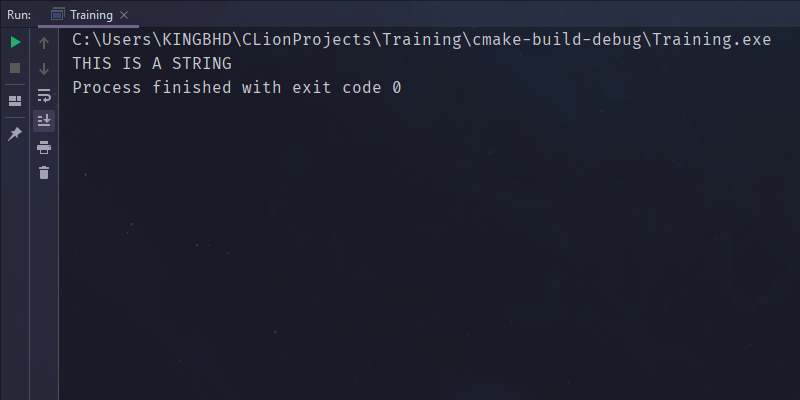
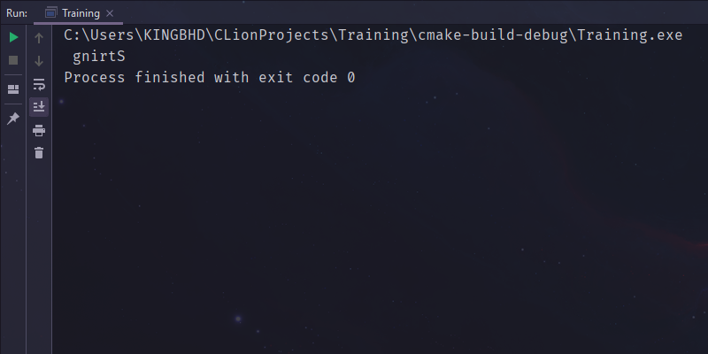

# Assignment

1. Program to switch cases to UPPERCASE with ASCII.
    - [Solution](string_to_upper_with_ascii_chart.c)
    - **Output:**
      

2. Program to reverse String without using String functions.
    - [Solution](string_reverse_without_string_functions.c)
    - **Output:**
      
